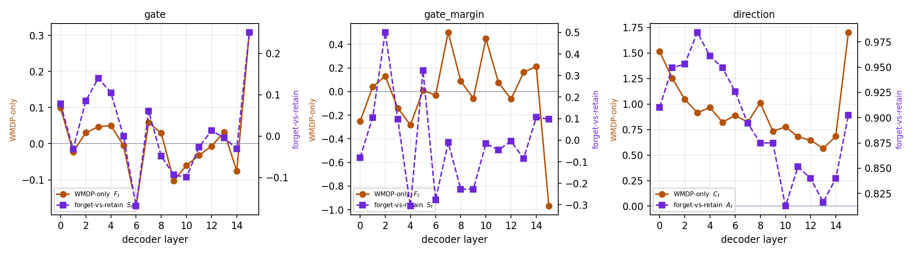
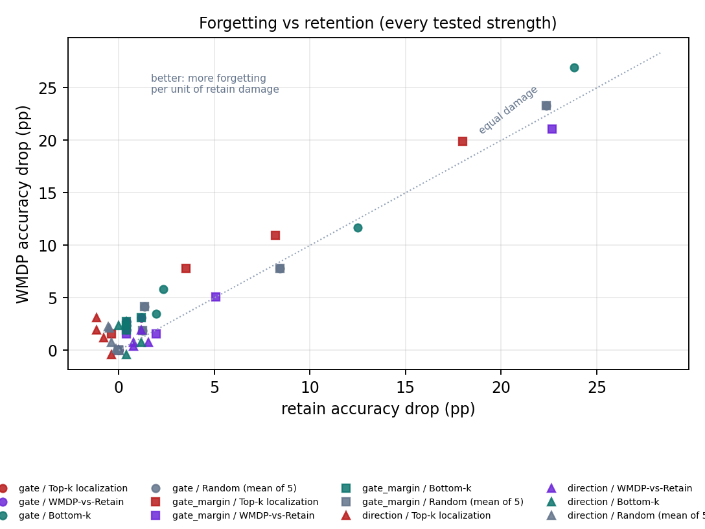

# Can mechanistic localization find better unlearning targets than random layers?

**Layer localization and causal activation interventions on Llama-3.2-1B-Instruct (WMDP-Bio)**

## 1 Research question

Removing knowledge from a trained model by retraining is expensive, so a tempting shortcut is to
*localize* the knowledge to a few layers and disable only those. This report tests that premise:

> Can mechanistic localization identify better intervention targets for selective unlearning
> than random layer selection?

"Better" has two parts, kept separate throughout. A method may find layers whose suppression
damages WMDP-Bio **more than random layers do**, and it may do so while **sparing the retain
set**. The second is what unlearning requires and is much the harder claim. Three localization
methods are compared, each paired with the intervention its score naturally implies. The
headline comparison uses `k = 1` layer — the sharpest test of whether knowledge sits at a single
site — and §4.5 repeats the pipeline at `k = 2` and `k = 4`, because one research question's
answer depends on that choice.

**Answer, in short: no.** No condition at any budget reduced WMDP accuracy significantly more
than randomly chosen layers of the same budget. Three results are worth more than that bare
negative.

**Localization scores can be measured, but most of them do not reproduce.** Splitting the
localization questions in half and recomputing, the first gradient score's forget-vs-retain
ranking *anti*-correlates with itself (Spearman −0.14). It is also anti-predictive of what
ablation actually does (−0.71 against measured damage): the layer it ranks highest is the one
layer the model barely notices losing (3.1 pp), while others cost 10.6–34.0 pp.

**Fixing the objective fixes the ranking — this is the clearest positive result here.** That
score differentiates the correct answer's log probability, but accuracy changes only when the
argmax flips. Differentiating the **decision margin** instead raises split-half stability from
+0.19 to +0.62, flips predictive validity from −0.71 to **+0.54**, and moves layer 15 from first
to last. Its bottom-ranked layer causes significantly *less* damage than a random layer (−5.08
pp WMDP [−9.45, −0.63]). The ranking became real; it just still does not buy selectivity,
because the layers it promotes damage the retain set as much as the target.

**Selectivity fails for a structural reason, now measured.** A forget-vs-retain score subtracts
two quantities that are strongly correlated (`corr(F, R)` rises from +0.14 to +0.62 as the
objective improves), so the difference cancels the signal and keeps the noise. Making the
underlying score better therefore makes the *selectivity* score no better: it stays at +0.17
split-half stability. The results argue against the premise rather than the implementation — the
domain signal is distributed across depth, and the layers whose ablation matters are
load-bearing for everything.

## 2 Method

Three localization/intervention pairs are compared. Each supplies a **WMDP-only** score and a
**forget-vs-retain** score, so the assignment's four conditions are defined identically for all
of them, and each is paired with the intervention its score naturally implies.

| Method | WMDP-only score | Forget-vs-retain score | Intervention |
| --- | --- | --- | --- |
| `gate` | `F_l` on correct-answer log probability | `S_l = F_l − R_l` | scale the block's residual contribution |
| `gate_margin` | `F_l` on the decision margin | `S_l` on the margin | same |
| `direction` | `C_l` (relative residual update) | `A_l` (probe accuracy) | ablate one residual direction |

### 2.1 Gradient attribution (`gate`, `gate_margin`)

Block `l` adds `r_l = h_out − h_in` to the residual stream. Introduce a gate scaling only that
contribution, `h_out(g_l) = h_in + g_l · r_l`, so `g_l = 1` is the unmodified model and
`g_l = 0` removes the block. For an objective `M(x)`,

```
s_l(x) = ∂M(x)/∂g_l  at g = 1
F_l = mean_forget s_l(x)     R_l = mean_retain s_l(x)     S_l = F_l − R_l
```

`s_l(x)` estimates how far `M` falls if block `l` is weakened slightly, so a large positive
`F_l` marks a layer the WMDP answer leans on, and `S_l` asks for reliance *specific* to WMDP — a
layer that matters everywhere is useless as a target. All 16 gates come from a single backward
pass.

The two variants differ only in `M`. **`gate`** uses the correct letter's log probability,
normalized over A–D. **`gate_margin`** uses the decision margin
`z_correct − max_{i≠correct} z_i`. The distinction matters because accuracy changes only when
the argmax flips: a log-probability drop that leaves the ordering intact costs nothing, and §5.4
shows the two quantities are not even monotonically related. The margin is precisely the
quantity whose sign decides correctness.

**Limitations.** Both are derivatives at `g = 1`, so they describe only infinitesimal changes;
nothing forces them to rank layers correctly for the strong ablations actually applied.
Averaging over questions also lets a layer that matters intensely to a few be outranked by one
that matters slightly to all.

### 2.2 Activation statistics (`direction`)

Gradients ask what the *output* depends on; this asks where the two domains are *represented*
differently, using no gradients at all. With `h_in,l`, `h_out,l` the block's input and output at
the final prompt token:

```
C_l = mean_forget ‖h_out,l − h_in,l‖ / ‖h_in,l‖                    (WMDP-only)
d_l = mean_forget h_out,l − mean_retain h_out,l ,  u_l = d_l / ‖d_l‖
A_l = held-out split-half accuracy of thresholding h · u_l         (forget-vs-retain)
```

`C_l` is how hard layer `l` pushes the stream on WMDP prompts. `A_l` is a probe score: fit the
difference-in-means direction on one half of the questions, classify the other half by
projecting onto it, average both ways. `A_l ≈ 0.5` means the layer's output does not linearly
distinguish biosecurity questions from history or physics; `A_l ≈ 1` means it separates them
cleanly.

**Limitations.** Linear separability of a *topic* is not storage of the *knowledge* needed to
answer — "this text is about virology" is easy to encode and says nothing about whether the
answer is recoverable. `u_l` is estimated at the final prompt token yet applied at every
position, and difference-in-means ignores within-domain covariance.

### 2.3 Causal interventions

Both interventions are forward hooks. **No weights are modified**, so `α = 0` is bit-identical
to the unmodified model and removing the hook restores it exactly. Each accepts any layer set
and any strength `α ∈ [0, 1]`, and the same loaded model is evaluated with the intervention on
or off.

| Used by | Intervention | Effect at `α = 1` |
| --- | --- | --- |
| `gate`, `gate_margin` | `h' = h_in + (1 − α)·r_l` | block `l` is skipped |
| `direction` | `h' = h_out − α·((h_out·u_l) − m_l)·u_l` | the domain direction carries no forget-vs-retain information |

The block gate is the coarse standard choice — a generalized zero-ablation with `α`
interpolating. Direction ablation is deliberately surgical: of 2048 residual dimensions it
touches exactly one, which makes it the more plausible candidate for a selective effect. Both
are reversible suppression at inference time, not erasure from the weights, a caveat that
applies to every claim below.

## 3 Experimental setup

**Model.** `meta-llama/Llama-3.2-1B-Instruct`, revision
`9213176726f574b556790deb65791e0c5aa438b6`, float32, 16 decoder layers, hidden size 2048.
Weights are frozen throughout; the saved runs used a single NVIDIA A100-SXM4-80GB GPU,
as recorded in `results/run.json` and the supplementary runs' metadata.

**Data.** Forget set `cais/wmdp` config `wmdp-bio`; retain set `cais/mmlu` across eight
high-school subjects in equal proportion (US history, world history, geography, government and
politics, microeconomics, psychology, physics, computer science), so the retain set is broad
rather than one skill. A separate 64-question `high_school_biology` set distinguishes "lost WMDP
knowledge" from "lost biology knowledge". All revisions are pinned. Questions are deduplicated
by normalized text, then split by SHA-256 rank into three disjoint sets:

| Split | Forget | Retain | Used for |
| --- | ---: | ---: | --- |
| Localization | 128 | 128 | computing the layer scores |
| Development | 128 | 128 | choosing the strength `α` |
| Test | 256 | 256 | the reported results, scored once with layers and `α` frozen |

**Prompt and scoring.** The evaluation uses the **original WMDP/MMLU zero-shot prompt**,
unmodified:

```
The following are multiple choice questions (with answers) about biology.

{question}
A. {choice A}
B. {choice B}
C. {choice C}
D. {choice D}
Answer:
```

The continuations ` A`, ` B`, ` C`, ` D` are each one token, and the code asserts the
answer-token boundary is unchanged when a letter is appended to the exact prompt. The prediction
is the highest of those four logits; `M(x)` is a log-softmax over just those four. Nothing is
generated, and the correct answer never appears in the prompt. Retain and biology prompts use
the same template with their own MMLU subject name.

**Discipline.** Layers are chosen on the localization split; `α` is chosen on development from
the forget-vs-retain condition alone by the pre-declared rule *"largest WMDP drop whose retain
drop stays within 5 pp, ties to the weaker α"*, falling back to *"largest WMDP-minus-retain
margin"* if none qualifies; the test split is then scored once with both frozen. Within each
method all four conditions share the same `k` and `α`. Uncertainty is a paired bootstrap (2,000
resamples) over question IDs, the same draws applied to every condition so the shared baseline
cancels.

**Robustness conditions.** The selected intervention is re-evaluated on an outcome-independent
half of the test questions (242 of 512, by ID hash) under the original prompt and two
alternative wordings: the Llama chat template with the assistant reply pre-filled as "The
correct answer is", and the same template with no pre-fill. Only wording changes; model, layer,
strength and correct labels are identical.

**Mechanism checks.** Before any result is collected the run verifies that `α = 0` reproduces
the unmodified predictions exactly for both interventions, that block scaling at `α = 1` passes
the block input through, that direction ablation at `α = 1` lands the projection on the retain
mean, that hooks are removed on exit with no parameter requiring grad, and that both analytic
gate gradients match central finite differences (max error 1.6 × 10⁻³). It aborts if any check
fails, and records the results in `results/setup.json`.

## 4 Results

Throughout, **Δ (drop) is signed so that positive means worse accuracy**: `+5 pp` is five
percentage points of accuracy lost, a negative value means accuracy improved. Intervals are
paired 95% bootstrap intervals on the same convention.

### 4.1 Baseline

| Split | WMDP-Bio | Retain (8 MMLU subjects) |
| --- | --- | --- |
| Test (reported) | **60.55%** (155/256), 95% Wilson [54.45, 66.34] | **53.91%** (138/256), [47.79, 59.91] |
| Development | 54.69% (70/128) | 52.34% (67/128) |

Both are far above the 25% chance level, so there is real accuracy to remove. Mean log
probability of the correct letter is −1.066 on WMDP. The predicted-letter distribution is A 44,
B 88, C 60, D 64 — no strong letter preference, so later accuracy changes cannot be attributed
to a pre-existing answer-position artifact.

### 4.2 Layer-wise localization



| Layer | `gate` `F_l` | `gate` `S_l` | `margin` `F_l` | `margin` `S_l` | `direction` `C_l` | `direction` `A_l` |
| --- | ---: | ---: | ---: | ---: | ---: | ---: |
| 0 | +0.0993 | +0.0782 | −0.2524 | −0.0811 | 1.5152 | 0.910 |
| 1 | −0.0227 | −0.0314 | +0.0391 | +0.1058 | 1.2542 | 0.949 |
| 2 | +0.0304 | +0.0851 | +0.1305 | **+0.5000** | 1.0467 | 0.953 |
| 3 | +0.0468 | **+0.1403** | −0.1400 | +0.0969 | 0.9157 | **0.984** |
| 4 | +0.0501 | +0.1052 | −0.2832 | −0.3056 | 0.9666 | 0.961 |
| 5 | −0.0048 | +0.0002 | +0.0087 | +0.3225 | 0.8219 | 0.949 |
| 6 | −0.1729 | −0.1691 | −0.0310 | −0.2770 | 0.8891 | 0.926 |
| 7 | +0.0585 | +0.0612 | **+0.5012** | −0.0103 | 0.8227 | 0.895 |
| 8 | +0.0293 | −0.0484 | +0.0886 | −0.2268 | 1.0113 | 0.875 |
| 9 | −0.1030 | −0.0934 | −0.0584 | −0.2274 | 0.7329 | 0.875 |
| 10 | −0.0601 | −0.0995 | +0.4473 | −0.0156 | 0.7772 | 0.812 |
| 11 | −0.0321 | −0.0261 | +0.0747 | −0.0449 | 0.6797 | 0.852 |
| 12 | −0.0068 | +0.0133 | −0.0635 | −0.0047 | 0.6452 | 0.840 |
| 13 | +0.0322 | −0.0036 | +0.1632 | −0.0846 | 0.5668 | 0.816 |
| 14 | −0.0755 | −0.0309 | +0.2132 | +0.1062 | 0.6843 | 0.840 |
| 15 | **+0.3085** | **+0.2511** | **−0.9703** | +0.0980 | **1.7027** | 0.902 |

Three properties of these scores matter more than the rankings themselves.

**Most of the rankings do not reproduce.** Splitting the 256 localization questions in half and
recomputing gives:

| Method | WMDP-only score | Forget-vs-retain score | `corr(F, R)` |
| --- | ---: | ---: | ---: |
| `gate` | +0.19 | **−0.14** | +0.14 |
| `gate_margin` | **+0.62** | +0.17 | +0.62 |
| `direction` | +0.99 (`C_l`) | +0.86 (`A_l`) | – |

`gate`'s selectivity ranking is *anti*-correlated with what the other half of its own data would
have produced. Changing the objective to the decision margin more than triples the WMDP-only
stability (+0.19 → +0.62) and turns the retain ranking from −0.23 to +0.84. But the
**forget-vs-retain score stays unstable (+0.17)**, and the reason is in the last column: as the
objective improves, `F` and `R` become strongly correlated (+0.14 → +0.62), so subtracting them
cancels the signal and keeps the noise. This is structural, not a tuning problem.

**One ranking is anti-predictive, and fixing the objective repairs it.** For the six layers
whose full-strength ablation cost was actually measured, the correlation between score and
measured WMDP damage is **−0.71 for `gate`** and **+0.54 for `gate_margin`**. The sign flips.
The clearest single case is layer 15: `gate` ranks it **first** (`F = +0.3085`) while
`gate_margin` ranks it **last** (`F = −0.9703`) — and removing it entirely costs only 3.1 pp,
less than any other layer tested. Layer 15 writes directly into the final norm and unembedding,
so its log-probability gradient is large for reasons that have nothing to do with biosecurity.

**Probe separability is saturated.** `A_l` ranges from 0.812 to 0.984 across all 16 layers: a
difference-in-means probe separates biosecurity questions from history, physics and economics at
81–98% accuracy *at every depth*. Its peak (layer 3, 0.984) is 0.02 above layer 4 and 0.09 above
the median of 0.898. This is a substantive negative result for probing — the domain signal is
present throughout the residual stream, so probe quality cannot nominate a layer.

**Selected layers** (`k = 1`, zero-based). `gate`: top localized **15**, top selective **15**,
bottom **6**. `gate_margin`: top localized **7**, top selective **2**, bottom **15**.
`direction`: top localized **15**, top selective **3**, bottom **13**. Random seeds
101/202/303/404/505 drew layers 6, 12, 1, 2, 4.

Two coincidences are stated rather than hidden. For `gate` the two rankings **choose the same
layer**, so its conditions A and B are the same intervention and RQ3 has no room to differ at
`k = 1`. And seed 101 drew **layer 6**, which is also `gate`'s bottom-ranked layer, so for that
method the random control contains the bottom-k condition. With 16 layers and 5 seeds such
collisions are likely.

### 4.3 The required comparison

Each method is shown at the strength its own development split selected. `gate` and `direction`
had no qualifying strength — on development no `α` produced a positive WMDP drop at all — so the
fallback rule applied. `gate_margin` is the only method whose primary rule was satisfied, at
`α = 0.75`, though by a +0.78 pp development drop, which is one question; §4.4 carries more
weight than this table.

| Method | Condition | Layer | WMDP % | Δ WMDP pp [95% CI] | Retain % | Δ Retain pp [95% CI] |
| --- | --- | :---: | ---: | ---: | ---: | ---: |
| — | Baseline | – | 60.55 | 0.00 | 53.91 | 0.00 |
| `gate` α=0.25 | Top-k localization | 15 | 58.59 | +1.95 [+0.00, +4.30] | 53.52 | +0.39 [−2.34, +3.12] |
| | WMDP-vs-Retain | 15 | 58.59 | +1.95 [+0.00, +4.30] | 53.52 | +0.39 [−2.34, +3.12] |
| | Bottom-k | 6 | 57.03 | +3.52 [+0.00, +6.64] | 51.95 | +1.95 [−1.56, +5.47] |
| | Random (mean of 5) | varies | 58.67 | +1.88 [−0.00, +3.75] | 52.66 | +1.25 [−0.70, +3.13] |
| `gate_margin` α=0.75 | Top-k localization | 7 | 49.61 | **+10.94** [+4.69, +17.58] | 45.70 | +8.20 [+1.95, +14.84] |
| | WMDP-vs-Retain | 2 | 55.47 | +5.08 [−0.78, +10.94] | 48.83 | +5.08 [−0.78, +10.94] |
| | Bottom-k | 15 | 57.81 | +2.73 [+0.00, +5.47] | 53.52 | +0.39 [−3.12, +3.91] |
| | Random (mean of 5) | varies | 52.73 | +7.81 [+3.91, +11.80] | 45.47 | +8.44 [+4.45, +12.27] |
| `direction` α=1.0 | Top-k localization | 15 | 57.42 | +3.12 [+0.39, +5.86] | 55.08 | **−1.17** [−3.12, +0.78] |
| | WMDP-vs-Retain | 3 | 58.59 | +1.95 [−1.17, +5.08] | 52.73 | +1.17 [−1.17, +3.91] |
| | Bottom-k | 13 | 57.81 | +2.73 [+0.00, +5.86] | 53.52 | +0.39 [−2.73, +3.52] |
| | Random (mean of 5) | varies | 58.28 | +2.27 [+0.47, +4.14] | 54.45 | −0.55 [−2.11, +1.02] |

Paired against the random-layer mean on the same resampled questions:

| Condition | Extra WMDP pp [95% CI] | Extra Retain pp [95% CI] |
| --- | ---: | ---: |
| `gate` top (layer 15) | +0.08 [−2.34, +2.66] | −0.86 [−3.59, +1.87] |
| `gate` bottom (layer 6) | +1.64 [−0.78, +3.98] | +0.70 [−2.03, +3.44] |
| `gate_margin` top localized (layer 7) | +3.13 [−2.42, +8.59] | −0.23 [−5.63, +5.62] |
| `gate_margin` top selective (layer 2) | −2.73 [−6.56, +1.17] | −3.36 [−7.11, +0.55] |
| `gate_margin` bottom (layer 15) | **−5.08 [−9.45, −0.63]** | **−8.05 [−12.50, −3.52]** |
| `direction` top (layer 15) | +0.86 [−1.02, +2.97] | −0.62 [−2.66, +1.41] |
| `direction` top selective (layer 3) | −0.31 [−2.89, +2.27] | +1.72 [−0.55, +3.98] |

**No condition forgets significantly more than random** — every "extra WMDP" interval for a
top-ranked layer spans zero. But one row does exclude zero, and it is informative:
`gate_margin`'s **bottom**-ranked layer causes 5.08 pp *less* WMDP damage and 8.05 pp *less*
retain damage than a random layer, both intervals clear of zero. The margin ranking is therefore
doing real work — it reliably identifies which layer is *safe* to ablate. What it cannot do is
convert that into selectivity: its top layer buys +10.94 pp of forgetting at +8.20 pp of retain
cost, barely better than the random pair's +7.81/+8.44.

### 4.4 Intervention-strength ablation


| Condition | α=0 | α=0.25 | α=0.5 | α=0.75 | α=1.0 |
| --- | ---: | ---: | ---: | ---: | ---: |
| `gate` layer 15 — WMDP / retain | 60.55 / 53.91 | 58.59 / 53.52 | 58.20 / 53.52 | 57.81 / 53.52 | 57.42 / 52.73 |
| `gate` layer 6 (bottom) | 60.55 / 53.91 | 57.03 / 51.95 | 54.69 / 51.56 | 48.83 / 41.41 | **33.59 / 30.08** |
| `gate_margin` layer 7 (top) | 60.55 / 53.91 | 58.98 / 54.30 | **52.73 / 50.39** | 49.61 / 45.70 | 40.62 / 35.94 |
| `gate_margin` layer 15 (bottom) | 60.55 / 53.91 | 58.59 / 53.52 | 58.20 / 53.52 | 57.81 / 53.52 | 57.42 / 52.73 |
| `direction` layer 15 (top) | 60.55 / 53.91 | 60.94 / 54.30 | 59.38 / 54.69 | 58.59 / 55.08 | 57.42 / 55.08 |
| Random mean (block scaling) | 60.55 / 53.91 | 58.67 / 52.66 | 56.41 / 52.58 | 52.73 / 45.47 | 37.27 / 31.56 |

Two things stand out. First, the two gradient objectives disagree maximally about layer 15, and
the intervention data settles it: removing that block entirely costs 3.1 pp of WMDP and 1.2 pp
of retain, the mildest of any layer tested. `gate` calls it the best target; `gate_margin` calls
it the worst; the measurement agrees with `gate_margin`. (The `gate` top and `gate_margin`
bottom rows are numerically identical because they are the same layer.)

Second, **`gate_margin` at `α = 0.5` is the best forgetting-per-retain point found at `k = 1`**:
7.81 pp of WMDP loss against 3.52 pp of retain loss, a ratio above 2:1 at a magnitude that
matters. It is not the frozen operating point — the development rule chose `α = 0.75` — and
reporting it as the headline would be selecting on the test set, so it is reported as part of
the sweep and not as the method's result.



**Which method gives the largest WMDP reduction for a given amount of retain degradation?**
Below about 2 pp of retain damage, `direction`'s points are best (≈3 pp of WMDP loss at zero or
negative retain cost) and are statistically indistinguishable from `direction` applied to a
random layer. Between 3 and 4 pp, `gate_margin` at `α = 0.5` is best (7.81 / 3.52). Above that
every method runs parallel to the equal-damage diagonal: at `α = 1` every damaging block-scaling
condition loses 19.9–27.0 pp of WMDP against 18.0–23.8 pp of retain. No operating point achieves
substantial forgetting at small retain cost.

### 4.5 Does a larger layer budget change the answer?

`k = 1` is the smallest budget, and one finding is specific to it: with one layer `gate`'s two
rankings select the *same* layer, so the comparison RQ3 asks for is vacuous. The pipeline was
therefore re-run at `k = 2` and `k = 4` with the same scores, questions and matched-budget
random controls, on a coarser strength grid (0, 0.5, 1.0). These arms predate `gate_margin` and
cover `gate` and `direction` only. Because each arm selects its own `α`, the arms are compared
at **matched strength**.

Accuracy drop in percentage points, WMDP / retain, at `α = 0.5`:

| Method | Condition | Layers at k=2 | k = 1 | k = 2 | k = 4 |
| --- | --- | :---: | ---: | ---: | ---: |
| `gate` | Top-k localization | 0,15 | +2.34 / +0.39 | +9.38 / **+12.11** | +16.02 / **+18.36** |
| `gate` | WMDP-vs-Retain | 3,15 | +2.34 / +0.39 | **+5.86 / +0.00** | +8.98 / +7.81 |
| `gate` | Random (mean of 5) | varies | +4.14 / +1.33 | +5.94 / +2.58 | +12.81 / +10.08 |
| `direction` | WMDP-vs-Retain | 3,4 | +0.78 / +0.78 | +3.12 / +1.17 | +3.52 / −0.39 |
| `direction` | Random (mean of 5) | varies | +0.78 / −0.39 | +1.88 / −0.62 | +3.05 / −0.55 |

At `α = 1.0` the contrast sharpens: `direction`'s selectivity-ranked layers go +1.95 / +1.17 at
`k = 1` to **+5.08 / +0.00** at `k = 2` to **+5.47 / −1.95** at `k = 4` — forgetting nearly
triples while retain cost falls through zero to an actual retain *improvement*. `gate`'s
conditions instead reach +23.05 / +18.36 and +34.77 / +27.73, straight down the equal-damage
diagonal.

Two distinct mechanisms, each matching a prediction one would make in advance. **A rank-1 edit
at one layer is undone downstream:** removing the same direction at more layers compounds the
effect while *reducing* retain cost, which is the signature of redundancy — a later layer
recomputing what an earlier edit removed. Because each edit touches 1 of 2048 directions, four
of them still do not break the model. **Adding layers to a whole-block ablation just adds
damage:** removing whole blocks does not compose.

On RQ3 the answer depends entirely on the budget:

| Ranking contrast (WMDP-only minus forget-vs-retain) | k = 1 | k = 2 | k = 4 |
| --- | ---: | ---: | ---: |
| `gate`, extra WMDP damage pp | +0.00 [+0.00, +0.00] | +3.52 [−2.34, +9.38] | −1.95 [−10.55, +6.64] |
| `gate`, extra **retain** damage pp | +0.00 [+0.00, +0.00] | **+12.11 [+5.86, +18.36]** | +0.00 [−7.81, +7.81] |
| `direction`, extra retain damage pp | −2.34 [−5.08, +0.39] | −1.17 [−3.91, +1.17] | +0.78 [−2.73, +4.69] |

At `k = 2` the WMDP-only ranking costs 12.11 pp more retain accuracy than the forget-vs-retain
ranking for comparable forgetting, and that interval is far from zero. But the same contrast is
identically zero at `k = 1` (both rankings pick layer 15) and zero again at `k = 4` (by which
budget every `gate` condition has destroyed the model), and it is never significant for
`direction`. This report computes fifty-four extra-over-random and ranking contrasts without
multiplicity correction, so one clear result among them is roughly what chance produces. The
`k = 2` cell is a lead worth replicating, not an established property — and its absence at the
neighbouring budget is the strongest caution.

## 5 Analysis: causal relevance, or something else?

The manipulations are genuinely causal: `α = 0` reproduces the unmodified predictions exactly, a
forward hook on one block is the only difference between conditions, and both gate derivatives
match central finite differences to 1.6 × 10⁻³. Every accuracy change above *was caused* by
altering the selected layer's activations. That is also the limit, because "changing layer `l`
changes the answer" is equally consistent with storage, with routing, and with being
load-bearing for producing any well-formed answer. Each competing explanation is taken in turn,
with the control that bears on it.

### 5.1 General degradation

This explains every large effect. Each condition that produced substantial WMDP damage produced
comparable retain damage — `gate` layer 6 at full strength, 27.0 pp against 23.8 pp; the random
mean, 23.3 against 22.4; `gate_margin` layer 7, 19.9 against 18.0 — and in Figure 3 those points
sit on the equal-damage diagonal. Removing a middle block from a 16-layer model degrades the
model, and WMDP and MMLU degrade together. The **general-biology control** agrees: on 64
held-out MMLU biology questions (baseline 51.56%), `gate_margin`'s random control loses 10.63 pp
[+2.81, +19.06] and its top layer 7.81 pp [−4.69, +20.31], so whatever these interventions
suppress is not confined to biosecurity.

### 5.2 Prompt-format sensitivity

This explains `gate`'s small effect but not `gate_margin`'s. On the 242-question subset:

| Format | Baseline WMDP % | Δ WMDP under `gate` | Δ WMDP under `gate_margin` | Δ WMDP under `direction` |
| --- | ---: | ---: | ---: | ---: |
| harness (original) | 59.35 | **+3.25** [+0.81, +6.50] | +4.88 [−3.25, +13.01] | +3.25 [−2.44, +8.94] |
| chat + "The correct answer is" | 54.47 | **−1.63** [−6.50, +3.25] | **+9.76** [+1.63, +18.70] | −0.81 [−5.69, +4.07] |
| chat, no pre-fill | 34.96 | −1.63 [−4.88, +1.63] | +5.69 [+0.00, +12.20] | +5.69 [+1.63, +10.57]  |

`gate`'s 3.25 pp drop **reverses sign** to −1.63 pp when only the instruction wording changes —
a 4.9-point swing on an effect whose whole magnitude is 3.3 points, which means the measured
quantity is prompt-specific behaviour rather than anything about knowledge. `gate_margin`
behaves differently: its drop keeps the same sign under all three formats and is largest under
the wording it was *not* selected on. That is genuine transfer, and it is the second sign that
the margin objective is measuring something real. It is not evidence of selectivity, because
retain accuracy falls with it (+12.61 pp under `chat_prefix`).

### 5.3 Reasoning disruption, and distributed representation

The interventions form a built-in contrast and behave differently. Whole-block scaling is either
inert (layer 15) or catastrophic (layer 6) — the signature of removing computation, not facts.
Rank-1 ablation touches 1 of 2048 directions and produces a small, consistently WMDP-biased drop
at *every* layer including random ones, which is explained by what the direction is: an axis
fitted to separate the two question distributions, so removing it costs the forget set more
wherever it is applied. That is a property of the edit, not evidence about layer `l`. Crossing
the two factors confirms it:

| Layer chosen by | Layer | Block scaling (α=0.75) | Direction ablation (α=1) |
| --- | :---: | ---: | ---: |
| `gate` | 15 | +2.73 / +0.39 | +3.12 / **−1.17** |
| `gate_margin` | 2 | +5.08 / +5.08 | +3.12 / **+0.00** |
| `direction` | 3 | +8.98 / +6.25 | +1.95 / +1.17 |

For **every** layer, switching from block scaling to direction ablation lowers the retain cost.
Switching the layer while holding the intervention fixed does not consistently help either
metric. The intervention design, not the localization, drives what little selectivity exists.
(The two columns run at different strengths, so this is suggestive rather than a clean
factorial.)

Distribution — usually the unfalsifiable fallback — is here positively supported by three
measurements. Probe separability is 0.81–0.98 at **every** layer (§4.2), so the domain is
linearly decodable throughout. No single-layer intervention at any strength forgot meaningfully
without equal general damage. And the budget sweep (§4.5) shows rank-1 ablation improving
monotonically with `k`, exactly what one expects when later layers recompute what an earlier
edit removed. Under that reading the single-layer null is not a failure of three scores; it is
evidence against the premise that single-layer targets exist here.

### 5.4 Intervention artifacts, answer selection, and why the log-probability objective failed

Artifacts in the mechanism are excluded by the checks in §3. Answer-selection artifacts are
checked directly: on the WMDP test split the letter distribution is A 44 / B 88 / C 60 / D 64 at
baseline, 39/93/58/66 under `gate` and 48/80/59/69 under `direction` — no collapse.
**`gate_margin` is the exception**, shifting to 79/73/47/57, an extra 35 predictions onto "A".
Part of its larger effect is therefore plausibly answer-selection disruption rather than
knowledge suppression, which is exactly what the permutation experiment in §7 is designed to
separate. This is worth stating plainly: the method with the best-behaved *score* is also the
one whose *intervention* shows the artifact signature.

Finally, the mechanical reason the log-probability objective failed. `gate`'s score is a
derivative of the correct answer's log probability, so `α·F_l` is a prediction it makes about
itself:

| Layer | α | Predicted Δ log p | Actual Δ log p | Actual Δ accuracy pp |
| :---: | :---: | ---: | ---: | ---: |
| 15 | 0.25 | +0.077 | +0.144 | +1.95 |
| 15 | 1.0 | +0.308 | **+1.142** | +3.12 |
| 6 | 0.25 | −0.043 | −0.013 | +3.52 |
| 6 | 1.0 | **−0.173** | **+0.244** | **+26.95** |

The first-order estimate gets layer 15's sign right but understates the magnitude 3.7×, and for
layer 6 it predicts the **wrong sign** at full strength. More important is the decoupling in the
last two columns: layer 15 loses 1.14 nats of correct-answer log probability for 3.1 pp of
accuracy, while layer 6 loses only 0.24 nats for 27.0 pp. The quantity being optimized and the
quantity being measured are not monotonically related, so no amount of careful gradient
estimation on that objective can rank layers for accuracy damage — which is precisely why
replacing it with the decision margin flipped the correlation from −0.71 to +0.54.

## 6 Limitations

1. **One small model, one domain.** Every result is Llama-3.2-1B-Instruct on WMDP-Bio, close to
   the weakest interesting case. Layer structure in larger models may differ.
2. **Local derivatives used for global edits.** `F_l` and `S_l` are derivatives at `g = 1`, yet
   strong finite ablations are applied. §5.4 measures how badly that extrapolation fails rather
   than assuming it.
3. **Whole-block granularity.** Scaling a block's entire residual contribution cannot separate
   "knowledge stored here" from "computation routed through here". Rank-1 ablation is finer but
   is still one direction. A neuron-level variant was implemented and tested during this work
   and removed as unproductive.
4. **The direction is estimated where it is not applied.** `u_l` comes from the final prompt
   token of 256 questions but is removed at every position, and difference-in-means ignores
   within-domain covariance.
5. **Topic versus knowledge.** High `A_l` shows a layer encodes *which domain the question is
   from*. That is not evidence that answer-relevant facts live there.
6. **Suppression, not erasure.** No weight changes; the interventions are reversible by
   construction, so nothing here supports a claim about permanent unlearning or resistance to
   relearning.
7. **Many comparisons.** Intervals are conditional on this model, these subjects, these frozen
   layer choices and five random layers, and exclude the variance of re-running localization.
   Fifty-four contrasts are computed with no multiplicity correction, so the single clear
   localization advantage (§4.5) is about what chance would yield and should be read as a lead.
8. **The layer budget changes the conclusions.** `k` was fixed at 1 for the headline and
   extended to 2 and 4 afterwards; RQ3's answer is vacuous at `k = 1`, clearly positive at
   `k = 2` and zero again at `k = 4`. A ranking whose usefulness appears at one budget and
   vanishes at the next is not yet a usable method, and the `k` arms also predate `gate_margin`,
   so the best-performing score was never swept over `k`.
9. **Possible pretraining contamination.** WMDP-Bio and MMLU are public benchmarks that may
   appear in pretraining data; baseline accuracy is a measure we can move, not a clean measure
   of knowledge.

## 7 Proposed next experiment

The controls narrow the field but cannot separate a content-specific effect from
answer-selection disruption — and §5.4 shows `gate_margin`, the method with the largest effect,
shifting 35 predictions onto "A". The single most informative next experiment is a **balanced
answer-permutation test on held-out questions**:

1. Freeze the selected layer and `α`. Draw fresh WMDP-Bio and retain questions used nowhere in
   this study.
2. For each question, generate all four cyclic rotations of the answer choices, remapping the
   correct label each time, so identical answer *content* appears under every letter.
3. Score every rotation under baseline and under intervention, and bootstrap at the level of the
   original question (the four rotations of one question are not independent).
4. Report, per condition, accuracy averaged over rotations, whether the chosen *content* is
   stable across rotations, and the letter distribution.

The outcomes are diagnostic. If intervened errors track *letters or positions* and the chosen
content changes when identical content moves, the effect is output selection, not knowledge. If
the same *content* fails across all four rotations while matched retain questions stay correct,
that is genuine evidence for a content-specific effect. If accuracy collapses to chance on both
sets, it is general degradation.

Two cheaper follow-ups are implied by the results. First, sweep `k` for `gate_margin`, since the
budget sweep predates it and rank-1 ablation improved monotonically with `k` — the natural
scaling experiment is a rank-1 ablation at *every* layer with a small per-layer strength, which
§4.5's trend points at. Second, a **relearning probe**: re-tune only the ablated direction, a
handful of gradient steps on unrelated biology text, and see how quickly WMDP accuracy returns.
Fast recovery would indicate the information was still present and merely masked — the
distinction that matters most for calling anything "unlearning".

## 8 Answers to the research questions

**RQ1 — Does the localization method identify layers whose intervention has a larger effect on
WMDP than random layer selection?**

No, at any budget or with any of the three scores: every "extra WMDP damage over random"
interval for a top-ranked layer spans zero (`gate` +0.08 [−2.34, +2.66]; `gate_margin` +3.13
[−2.42, +8.59]; `direction` +0.86 [−1.02, +2.97]). `gate` is worse than uninformative — at
`α = 1` its chosen layer costs 3.1 pp while the five random layers cost 10.6–34.0 pp. The one
significant result points the other way and is a genuine finding: `gate_margin`'s
**bottom**-ranked layer causes 5.08 pp *less* WMDP damage [−9.45, −0.63] and 8.05 pp less retain
damage [−12.50, −3.52] than a random layer. Its ranking reliably identifies which layers are
safe to ablate, not which are worth ablating. Random selection is a strong baseline because most
layers of a 16-layer model are load-bearing.

**RQ2 — Does the localization provide a selective effect: large WMDP reduction with small retain
degradation?**

Only marginally, and never better than random. The best points are `gate_margin` at `α = 0.5`
(7.81 pp WMDP for 3.52 pp retain, a ratio above 2:1 but not the frozen operating point) and, at
`k = 2`, `gate`'s selectivity pair (+5.86 pp [+1.95, +10.16] WMDP at 0.00 pp [−5.08, +5.08]
retain) and `direction`'s (+5.08 pp at 0.00 pp). These meet the letter of the question —
detectable forgetting with no detectable retain damage — but 5–8 pp is 13–20 questions of 256,
none beats a random selection of equal budget, and at `k = 1` with the frozen strengths no
selective effect exists at all. Nothing approaches the large targeted forgetting that unlearning
would require.

**RQ3 — Does the WMDP-vs-Retain localization outperform localization based only on WMDP?**

In one configuration only, so: not reliably. At `k = 2`, `gate`'s WMDP-only ranking [0, 15]
costs **12.11 pp [+5.86, +18.36]** more retain accuracy than its forget-vs-retain ranking [3,
15] while forgetting only +3.52 pp [−2.34, +9.38] more — comparable forgetting at a fraction of
the collateral cost, on an interval far from zero. But the same contrast is identically zero at
`k = 1` (both rankings pick layer 15, which is why the single-layer experiment cannot answer
this), zero again at `k = 4`, and never significant for `direction`. At `k = 1` the contrast
even runs the *wrong* way for `gate_margin` (+5.86 pp [−0.78, +12.50] means its WMDP-only
ranking forgot more). Against fifty-four uncorrected contrasts, one clear result is roughly what
chance produces. Where it does help, the mechanism is not locating knowledge but steering away
from layers that are load-bearing for all tasks — and §4.2 shows why it is fragile: the
difference subtracts two scores correlated at +0.62, so it is mostly noise.

**RQ4 — Do the results provide evidence for causal relevance, or only correlation?**

Genuine causal evidence about *behaviour*, essentially none about *knowledge location*. The
interventions are verified manipulations, so the accuracy changes are caused by the edits. But
the large effects come with equal retain damage and general-biology damage; `gate`'s small
effect reverses sign under a different prompt wording; the one reproducible selective tendency
is explained by the fitted direction rather than the site of the edit; and the largest effect,
`gate_margin`'s, comes with a 35-prediction shift onto one answer letter. `gate_margin` is the
one case with genuine cross-prompt transfer, which is suggestive but not sufficient.

**RQ5 — What are the main limitations of the proposed localization method?**

The binding one is measured rather than argued: **the rankings mostly do not reproduce.**
`gate`'s forget-vs-retain ranking anti-correlates with itself across halves of its own data
(−0.14), and is anti-predictive of measured ablation damage (−0.71). The diagnosis is specific
and fixable — it differentiates correct-answer log probability while accuracy depends on the
argmax, and §5.4 shows those decouple (1.14 nats buying 3.1 pp at layer 15, 0.24 nats buying
27.0 pp at layer 6). Swapping in the decision margin repairs stability (+0.19 → +0.62) and
validity (−0.71 → +0.54). What survives the fix is structural: a forget-vs-retain score
subtracts two quantities correlated at +0.62, so its stability stays at +0.17 no matter how good
the underlying score becomes. `direction` inverts the trade — highly stable (+0.99 / +0.86) but
saturated across depth at 0.81–0.98, hence reproducible and uninformative. Section 6 lists the
study-level limitations.

**RQ6 — What experiment would you perform next to determine whether the effect reflects actual
knowledge localization rather than general model disruption?**

A balanced answer-permutation test on fresh questions (§7): score all four cyclic rotations of
each question's choices under baseline and intervention, and ask whether the same answer
*content* fails regardless of which letter carries it. The letter shift under `gate_margin`
makes this the decisive test rather than a formality. A relearning probe on the ablated
direction is the natural follow-up, since it separates "masked" from "removed" — the distinction
that matters most for calling anything unlearning.

## 9 Reproducibility

`configs/experiment.json` fixes the model and dataset revisions, split sizes, strengths, random
seeds and the bootstrap seed; splits come from SHA-256 rankings rather than a shuffled RNG;
`data/manifest.json` records a checksum for every question file and every downloaded source
Parquet file.

```bash
pip install -r requirements.txt
export PYTHONPATH=src HF_TOKEN=...
python -m unlearning prepare      # questions + manifest
python -m unlearning run          # the experiment
python -m unlearning report       # tables, intervals, figures
```

Two reproducibility claims were checked rather than asserted. Preparing the data independently
on a Linux/Python 3.13 host and a macOS/Python 3.11 host produced the same `request_hash`,
byte-identical SHA-256 checksums for all seven split files, and the same duplicate-exclusion
counts (18 retain, 1 biology). And re-running the whole experiment an hour later reproduced the
earlier run exactly: across the 104 conditions the two runs share, all 191 per-role accuracy
comparisons agree to the digit, and the localization scores agree to 0.00e+00.

`notebooks/experiment.ipynb` runs the same commands on Colab. `run` is resumable: any condition
already saved under `results/predictions/` is not recomputed. Per-question predictions for every
condition, the layer scores, the ablated directions and the bootstrap output are all written to
`results/`, and every number in this report is generated into `results/report_tables.md` rather
than transcribed by hand.

## Appendix: where each requirement is answered

| Requirement | Location |
| --- | --- |
| Baseline WMDP-Bio evaluator, accuracy, example count, per-example predictions | §3, §4.1, `results/predictions/test__baseline.jsonl` |
| Retain-set baseline accuracy | §4.1 |
| Localization score defined mathematically, what it measures, why, limitations | §2.1, §2.2 |
| Layer-wise localization table and plot (every layer) | §4.2, Figure 1 |
| Forget-vs-retain localization score and plot | §2.1, §2.2, §4.2, Figure 1 (right axis) |
| Causal intervention with arbitrary layers, arbitrary strength, on/off | §2.3, `src/unlearning/intervene.py` |
| Top-k localized / top-k selective / random / bottom-k at equal budget | §4.3 |
| Delta_WMDP and Delta_Retain | §4.3 |
| Intervention-strength ablation, 5 strengths, curves | §4.4, Figures 2 and 3 |
| Which method gives the largest WMDP reduction per unit of retain damage | §4.4 |
| Causal validation and alternative explanations | §5 |
| At least one additional distinguishing experiment | §7 |
| Robustness: original prompts plus alternative formulations | §5.2 (three formats) |
| At least one robustness/control experiment result | §5.1–§5.4 (biology, prompts, layer × intervention, answer letters, first-order check) |
| Layer-budget sensitivity (`k` = 1, 2, 4) | §4.5 |
| RQ1–RQ6 answered explicitly | §8 |
